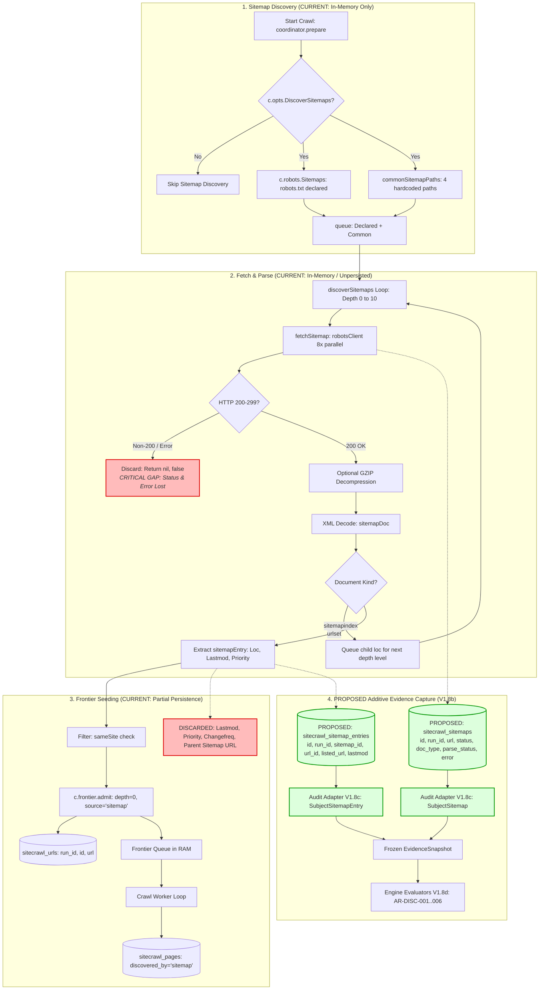

# Audit V1.8a: Sitemap Acquisition & Evidence Design

## 1. Executive Summary

- **Milestone:** Audit V1.8a — Sitemap Acquisition & Evidence Design
- **Phase Intent:** Analysis & Design Only (Zero production Go code diff; no SQLite schema modifications; no evaluator registrations)
- **Approved Baseline Git HEAD:** `56b7b566d93390b551253f18f5b4fcafc5a4af04`
- **Knowledge Revision:** `v1.4.4`
- **NormalizationVersion:** `v1.8.0` (frozen, unchanged)
- **Current Executable Rules:** Exactly `13 / 47` (`AR-ACC-004`, `AR-CANON-003`, `AR-CANON-004`, `AR-CANON-006`, `AR-CANON-007`, `AR-CANON-008`, `AR-CANON-009`, `AR-ENTITY-001`, `AR-INDEX-001`, `AR-INDEX-002`, `AR-LINK-002`, `AR-LINK-003`, `AR-LINK-004`)
- **Target Rules Analyzed:** All 6 frozen sitemap rules (`AR-DISC-001`, `AR-DISC-002`, `AR-DISC-003`, `AR-DISC-004`, `AR-DISC-005`, `AR-DISC-006`)

### Core Findings
1. **Acquisition Gap:** Standalone SiteCrawl (`internal/sitecrawl/sitemap.go`, `crawler.go:252-267`) discovers sitemaps (via `robots.txt` declared sitemaps and 4 hardcoded common paths) and parses `<url><loc>` elements exclusively to seed its in-memory URL frontier.
2. **Persistence Void:** **Zero sitemap document or sitemap entry telemetry is persisted to SQLite.** The crawler does not store the sitemap URLs discovered, their fetch HTTP status codes, response headers, redirect chains, XML parse diagnostics, or entry metadata (`<lastmod>`, `<changefreq>`, `<priority>`). Furthermore, the mapping linking a crawled URL back to its containing sitemap document is completely discarded.
3. **Evidence Adapter State:** The Audit Evidence Adapter explicitly records `GapSitemapDocumentUnavailable` (`internal/audit/adapter/adapter.go:1454-1458`) on every run because SiteCrawl retains no formal `SitemapObservation` or `SitemapEntry` records. The adapter's only current sitemap awareness is setting `DiscoveryRecord(DiscoveryType: SITEMAP)` if `sitecrawl_pages.discovered_by == "sitemap"`.
4. **Rule Readiness:** All six sitemap rules (`AR-DISC-001` through `AR-DISC-006`) remain classified as **`NEEDS_ACQUISITION`**. None can be evaluated deterministically under the existing SQLite persistence schema without producing severe false positives or unevidenced conclusions.
5. **Architectural Path:** We propose a minimal, backwards-compatible, three-slice phased implementation:
   - **V1.8b:** Additive raw evidence persistence in SiteCrawl (`sitecrawl_sitemaps` and `sitecrawl_sitemap_entries` tables).
   - **V1.8c:** Audit Evidence Adapter normalization exposing `SubjectSitemap` and `SubjectSitemapEntry` observations into the frozen `EvidenceSnapshot`.
   - **V1.8d:** Engine evaluators for sitemap rules with verified evidence integrity.

---

## 2. Approved Baseline & Scope

### 2.1 Baseline State
- **Git HEAD:** `56b7b566d93390b551253f18f5b4fcafc5a4af04`
- **Branch:** `main`
- **Clean Working Tree:** Confirmed before analysis.
- **NormalizationVersion:** `v1.8.0`.
- **Executable Rule Count:** `13 / 47`.

### 2.2 Strict Design-Only Scope
This document represents an architectural specification. Under V1.8a constraints:
- **ZERO DIFF** in production Go code (`internal/sitecrawl/**`, `cmd/sitecrawl-dev/**`, `go/deps/**`, `internal/platform/standalone/**`, `internal/audit/adapter/**`, `internal/audit/engine/**`, `internal/audit/model.go`, `internal/audit/rules_v1.json`).
- **ZERO DIFF** in SQLite schemas, triggers, or migrations.
- **ZERO DIFF** in authoritative knowledge documents (`knowledge/**`).
- **NO EVALUATORS IMPLEMENTED** (evaluator count strictly maintained at 13/47).
- **NO NEW DEPENDENCIES** introduced.

---

## 3. Current SiteCrawl Sitemap Flow

### 3.1 End-to-End Code Trace

| Flow Step | File & Location | Current Implementation Behavior | Audit V1 Consequence |
|---|---|---|---|
| **1. Discovery Trigger** | [`internal/sitecrawl/crawler.go:252-255`](file:///d:/Projects/audit%20technical/sitecrawl-docs/internal/sitecrawl/crawler.go#L252-L255) | Executed only if `c.opts.DiscoverSitemaps && origin != ""` during `coordinator.prepare()` before the crawler worker loop begins. If disabled, sitemap discovery is completely bypassed. | If option is false, no sitemap evidence exists; cannot evaluate `AR-DISC-001` without knowing intent. |
| **2. Robots.txt Declarations** | [`internal/sitecrawl/robots.go:150-153`](file:///d:/Projects/audit%20technical/sitecrawl-docs/internal/sitecrawl/robots.go#L150-L153), [`robots.go:206-229`](file:///d:/Projects/audit%20technical/sitecrawl-docs/internal/sitecrawl/robots.go#L206-L229) | `c.robots.Sitemaps(ctx, origin)` extracts `Sitemap:` lines from robots.txt raw bytes via `parseSitemapLines()`. Comments (`#`) are stripped, lines split by the first colon. | Declarations are read from robots.txt into memory, but the list of declared sitemap URLs is never persisted to SQLite. |
| **3. Common Path Probing** | [`internal/sitecrawl/sitemap.go:34-39`](file:///d:/Projects/audit%20technical/sitecrawl-docs/internal/sitecrawl/sitemap.go#L34-L39), [`sitemap.go:90-92`](file:///d:/Projects/audit%20technical/sitecrawl-docs/internal/sitecrawl/sitemap.go#L90-L92) | Hardcodes 4 paths: `/sitemap.xml`, `/sitemap_index.xml`, `/sitemaps.xml`, `/sitemap/sitemap.xml`. Unconditionally appends `origin + path` to the initial discovery queue. | Common paths are always probed even when robots.txt specifies sitemaps, but probe successes/failures are not logged. |
| **4. Explicit Input** | [`internal/sitecrawl/types.go:179`](file:///d:/Projects/audit%20technical/sitecrawl-docs/internal/sitecrawl/types.go#L179) | `Options` struct contains only boolean `DiscoverSitemaps`. No field exists for user-supplied explicit sitemap URLs or sitemap index overrides. | Cannot test user-provided sitemap URLs outside robots.txt or the 4 common paths without extending options. |
| **5. Scheduling & Concurrency** | [`internal/sitecrawl/sitemap.go:79-88`](file:///d:/Projects/audit%20technical/sitecrawl-docs/internal/sitecrawl/sitemap.go#L79-L88), [`sitemap.go:117-142`](file:///d:/Projects/audit%20technical/sitecrawl-docs/internal/sitecrawl/sitemap.go#L117-L142) | Traverses breadth-first by depth level (`depth <= sitemapMaxDepth`). Dedupes level URLs via `seen` map. Concurrently fetches each level with semaphore bounded by `parallel = min(c.opts.Concurrency, 8)`. | Results collected in slice by index `docs[i]`; concurrency is capped to avoid CMS load spikes. |
| **6. HTTP Client & Redirects** | [`internal/sitecrawl/crawler.go:254`](file:///d:/Projects/audit%20technical/sitecrawl-docs/internal/sitecrawl/crawler.go#L254), [`internal/sitecrawl/fetch.go:127-140`](file:///d:/Projects/audit%20technical/sitecrawl-docs/internal/sitecrawl/fetch.go#L127-L140) | Uses `c.fetch.robotsClient()`, which wraps `http.Client` with `CheckRedirect` following up to `maxRedirects = 10` hops. User-agent preset is applied via `ua.apply()`. | Redirects are followed transparently, but intermediate redirect hops, initial status, and final URL are **discarded**. |
| **7. Sitemap Fetch & Response Check** | [`internal/sitecrawl/sitemap.go:168-184`](file:///d:/Projects/audit%20technical/sitecrawl-docs/internal/sitecrawl/sitemap.go#L168-L184) | Issues HTTP GET. If `res.StatusCode < 200 || res.StatusCode >= 300`, discards body up to `drainCap (1MB)` and returns `nil, false`. | Non-200 responses (3xx, 4xx, 5xx) or network errors simply return `false`. **Status code is discarded**; `AR-DISC-002` cannot know if a failed sitemap was 404 vs 500 vs timeout. |
| **8. Decompression** | [`internal/sitecrawl/sitemap.go:189-197`](file:///d:/Projects/audit%20technical/sitecrawl-docs/internal/sitecrawl/sitemap.go#L189-L197) | Checks if URL ends with `.gz` or `Content-Type` contains `gzip`. If so, wraps reader in `gzip.NewReader(body)` with `LimitReader(sitemapByteCap)` (64MB). | Handles `.xml.gz` sitemaps in the wild; failures return `nil, false`. |
| **9. XML Parsing** | [`internal/sitecrawl/sitemap.go:199-211`](file:///d:/Projects/audit%20technical/sitecrawl-docs/internal/sitecrawl/sitemap.go#L199-L211) | Uses `xml.NewDecoder(body)` with `dec.Strict = false` and identity `CharsetReader`. Decodes into `sitemapDoc`. | Forgiving parser ignores XML namespaces and encoding errors. If `xml.Decode` fails, returns `nil, false`; **parse error message is discarded**. |
| **10. Sitemap Index Traversal** | [`internal/sitecrawl/sitemap.go:60-62`](file:///d:/Projects/audit%20technical/sitecrawl-docs/internal/sitecrawl/sitemap.go#L60-L62), [`sitemap.go:158-162`](file:///d:/Projects/audit%20technical/sitecrawl-docs/internal/sitecrawl/sitemap.go#L158-L162) | `<sitemap><loc>` elements are extracted and appended to `queue` for the next depth level loop. Max depth capped at `sitemapMaxDepth = 10`. | Supports sitemap index hierarchies up to 10 levels, but parent-child relationships between sitemaps are not tracked. |
| **11. Entry Extraction** | [`internal/sitecrawl/sitemap.go:54-59`](file:///d:/Projects/audit%20technical/sitecrawl-docs/internal/sitecrawl/sitemap.go#L54-L59), [`sitemap.go:148-157`](file:///d:/Projects/audit%20technical/sitecrawl-docs/internal/sitecrawl/sitemap.go#L148-L157) | Extracts `<url>` elements into `sitemapEntry{Loc, LastMod, ChangeFreq, Priority}`. Capped at `sitemapMaxURLs = 200,000`. | Reads entries into memory slice. `LastMod`, `ChangeFreq`, `Priority` are captured in Go memory but immediately discarded. |
| **12. Frontier Admission** | [`internal/sitecrawl/crawler.go:256-265`](file:///d:/Projects/audit%20technical/sitecrawl-docs/internal/sitecrawl/crawler.go#L256-L265) | Filters entries by `url.Parse` and `sameSite(seedHost, u.Hostname())`. Calls `c.frontier.admit(e.Loc, 0, SourceSitemap, 0)`. Discards return value `read []string`. | URLs enter frontier at `depth = 0`, `source = "sitemap"`. Source sitemap document ID is not passed to frontier. |
| **13. SQLite URL Insertion** | [`internal/sitecrawl/frontier.go:135-140`](file:///d:/Projects/audit%20technical/sitecrawl-docs/internal/sitecrawl/frontier.go#L135-L140), [`frontier.go:160-209`](file:///d:/Projects/audit%20technical/sitecrawl-docs/internal/sitecrawl/frontier.go#L160-L209) | `frontier.admit` allocates a dictionary `ID` and appends to `f.pending`. Coordinates flushes to `sitecrawl_urls(run_id, id, url)`. | URL is stored in dictionary. If crawled, `sitecrawl_pages.discovered_by = 'sitemap'`. No sitemap metadata table exists. |
| **14. Error & Limit Handling** | [`internal/sitecrawl/sitemap.go:18-31`](file:///d:/Projects/audit%20technical/sitecrawl-docs/internal/sitecrawl/sitemap.go#L18-L31), [`sitemap.go:134-138`](file:///d:/Projects/audit%20technical/sitecrawl-docs/internal/sitecrawl/sitemap.go#L134-L138) | Panics caught with `safe.Do`. Exceeding limits (64MB byte cap, 10 index depth, 200k URLs) terminates acquisition cleanly without error emission. | Silent truncation: no telemetry indicates whether a 200k URL crawl hit sitemap limits or parsed all available sitemaps. |

### 3.2 Existing vs Proposed Flow Diagram



---

## 4. SQLite Persistence Inventory

We performed a complete inspection of all SQLite tables in `internal/sitecrawl/runs.go:17-195`. Below is the audit classification of every piece of sitemap evidence required for V1:

| Data Field / Concept | Existing SQLite Storage | Current State | Explanation & Exact Source Reference |
|---|---|---|---|
| **Crawl run sitemap discovery option** | `sitecrawl_runs.options` | `PERSISTED` | JSON blob in `options` column contains `"discoverSitemaps": true/false` (`runs.go:21`). |
| **Sitemap discovery completion flag** | None | `NOT_ACQUIRED` | `sitecrawl_runs` has state/phase/stop_reason, but no telemetry indicating whether sitemap discovery ran to exhaustion, hit caps, or timed out. |
| **Robots-declared sitemap URLs** | None | `NOT_ACQUIRED` | Parsed in RAM (`robots.go:197`), used in `crawler.go:253`, never written to SQLite. |
| **Discovered sitemap document URLs** | None | `NOT_ACQUIRED` | `discoverSitemaps` returns `read []string` (`sitemap.go:165`), but `crawler.go:254` discards it (`entries, _ := ...`). |
| **Sitemap HTTP fetch request timestamp** | None | `NOT_ACQUIRED` | Fetch timing is not recorded for sitemaps (`sitemap.go:168-184`). |
| **Sitemap HTTP response status code** | None | `NOT_ACQUIRED` | `fetchSitemap` evaluates `res.StatusCode`, but discards it on error or non-200. Only valid 200 documents proceed to decode (`sitemap.go:180-183`). |
| **Sitemap fetch error details** | None | `NOT_ACQUIRED` | Network errors, TLS errors, timeouts, and redirect limit errors return `false` without persistence (`sitemap.go:171, 177`). |
| **Sitemap redirect traversal hops** | None | `NOT_ACQUIRED` | `robotsClient` follows redirects (`fetch.go:133`), but final URL and intermediate hops are never inspected or recorded. |
| **Sitemap raw XML payload** | None | `NOT_ACQUIRED` | Body is streamed directly into `xml.NewDecoder` and discarded (`sitemap.go:200-207`). |
| **Sitemap document type (`urlset` vs `sitemapindex`)** | None | `NOT_ACQUIRED` | `sitemapDoc` decodes both in RAM (`sitemap.go:53-63`), but type classification is not saved. |
| **Sitemap XML syntax parse status & error** | None | `NOT_ACQUIRED` | Parse failure silently returns `nil, false` (`sitemap.go:206`). Error message is never preserved. |
| **Sitemap entry listed URL string** | `sitecrawl_urls.url` | `DERIVABLE_WITH_LIMITATIONS` | If entry passes `sameSite` filter, it enters `sitecrawl_urls` dictionary (`frontier.go:139`). However, it is indistinguishable from link-discovered URLs in this table! |
| **Sitemap entry `<lastmod>` string** | None | `NOT_ACQUIRED` | Extracted into `sitemapEntry.LastMod` in RAM (`sitemap.go:154`), but discarded during frontier admission (`crawler.go:264`). |
| **Sitemap entry order / index** | None | `NOT_ACQUIRED` | Sequence in XML is discarded. |
| **URL-to-Sitemap correlation link** | None | `NOT_ACQUIRED` | **CRITICAL GAP:** There is NO reference linking a URL in `sitecrawl_urls` to the specific sitemap file that listed it. |
| **Page discovery provenance: sitemap** | `sitecrawl_pages.discovered_by` | `DERIVABLE_WITH_LIMITATIONS` | Set to `"sitemap"` **ONLY IF** the URL was first offered by sitemap and later crawled (`page.go:162`). If a page was discovered by link first, sitemap discovery is ignored. If never crawled, `sitecrawl_pages` has no record! |
| **Sitemap-listed URL final HTTP status** | `sitecrawl_pages.status` | `DERIVABLE_WITH_LIMITATIONS` | Available **ONLY IF** the sitemap-listed URL was crawled. If crawl stopped early or max-urls was reached, status is missing. |
| **Sitemap-listed URL canonical declaration** | `sitecrawl_pages.canonical` | `DERIVABLE_WITH_LIMITATIONS` | Available only if crawled and HTML parsed (`page.go:182`). |
| **Sitemap-listed URL effective noindex** | `sitecrawl_pages.meta_robots`, `x_robots` | `DERIVABLE_WITH_LIMITATIONS` | Available only if crawled and HTML parsed (`page.go:183-184`). |

---

## 5. Six-Rule Evidence Readiness Matrix

| Rule ID | Name & Scope | Required Evidence | Existing Source | Persistence State | Missing Dependency | Policy Dependency | False-Positive / Risk Boundary | Readiness |
|---|---|---|---|---|---|---|---|---|
| **`AR-DISC-001`** | Sitemap presence matches project policy (`DISC-001`) | `discovered_sitemap_urls`, `sitemap_expected`, `sitemap_discovery_complete` | `c.robots.Sitemaps()`, `commonSitemapPaths` | `NOT_ACQUIRED` | Persistence of discovered sitemaps, checked sources, and completion signal | `sitemap_expected` (explicit policy: true, false, or unspecified) | **HIGH:** Zero discovered sitemaps must NOT be a FAIL. If `sitemap_expected=false` → `NOT_APPLICABLE`. If policy unspecified → `MANUAL_REVIEW`. Incomplete discovery → `UNKNOWN`. | **`NEEDS_ACQUISITION`** |
| **`AR-DISC-002`** | Sitemap document returns 200 (`DISC-002`) | `sitemap_url`, `sitemap_fetch_status` | `fetchSitemap()` HTTP call | `NOT_ACQUIRED` | Persistent record of sitemap fetch attempts and HTTP status codes | None | **HIGH:** Cannot substitute regular crawled page status. Must reflect the actual sitemap document fetch. Request failure prior to HTTP response → `UNKNOWN`. | **`NEEDS_ACQUISITION`** |
| **`AR-DISC-003`** | Sitemap is parseable (`DISC-002`) | `sitemap_url`, `sitemap_fetch_status`, `sitemap_parse_status`, `sitemap_parse_error` | `fetchSitemap()` XML decode | `NOT_ACQUIRED` | Persistent record of XML parse status, error string, and document type | None | **HIGH:** HTTP 200 does not imply valid sitemap XML. Body not retrieved → `NOT_APPLICABLE`. Parser unable to run → `UNKNOWN`. Syntax error → `FAIL`. | **`NEEDS_ACQUISITION`** |
| **`AR-DISC-004`** | Sitemap-listed URL returns final 200 (`DISC-002`) | `sitemap_url`, `listed_url`, `listed_url_status` | `sitemapEntry.Loc`, `sitecrawl_pages.status` | `NOT_ACQUIRED` (correlation missing); `DERIVABLE_WITH_LIMITATIONS` (URL status) | Persistent mapping between sitemap document and listed URL; crawl status of listed URL | None | **CRITICAL:** Cannot evaluate without proving entry came from sitemap. If listed URL was not crawled / unreachable → `UNKNOWN`. 3xx/4xx/5xx → `FAIL`. 200 → `PASS`. | **`NEEDS_ACQUISITION`** |
| **`AR-DISC-005`** | Sitemap-listed URL is not noindex (`DISC-002`) | `sitemap_url`, `listed_url`, `listed_url_status`, `listed_url_effective_noindex` | `sitemapEntry.Loc`, `sitecrawl_pages.meta_robots`/`x_robots` | `NOT_ACQUIRED` (correlation missing); `DERIVABLE_WITH_LIMITATIONS` (directives) | Persistent sitemap-to-entry mapping; normalized effective noindex on crawled URL | None | **HIGH:** Precondition requires listed URL is 200 HTML. If non-200 or directives unavailable → `NOT_APPLICABLE` or `UNKNOWN`. `effective_noindex=true` → `FAIL`. | **`NEEDS_ACQUISITION`** |
| **`AR-DISC-006`** | Sitemap-listed URL canonicalizes to itself (`DISC-002`) | `sitemap_url`, `listed_url`, `listed_url_canonical` | `sitemapEntry.Loc`, `sitecrawl_pages.canonical` | `NOT_ACQUIRED` (correlation missing); `DERIVABLE_WITH_LIMITATIONS` (canonical) | Persistent sitemap-to-entry mapping; normalized canonical declaration on crawled URL | None | **HIGH:** Precondition requires exactly one valid canonical declaration. No canonical → `NOT_APPLICABLE`. Canonical equals listed URL → `PASS`. Points elsewhere → `FAIL`. | **`NEEDS_ACQUISITION`** |

---

## 6. Proposed Evidence Model

To satisfy the frozen contracts in `knowledge/09-data-model.md:601-638` and `internal/audit/model.go:218-240`, we specify the exact structure of `SitemapObservation` and `SitemapEntry`.

### 6.1 `SitemapObservation` (Document-Level Subject: `SubjectSitemap`)
Represents an individual XML sitemap document or sitemap index file fetched during discovery.

| Field Name | Type | Provenance / Origin | Derivation | Purpose & Associated Rule | Handling When Missing / Unavailable |
|---|---|---|---|---|---|
| `SitemapID` | `audit.SitemapID` | Generated deterministic ID | `sm:<audit_run_id>:<hash(sitemap_url)>` | Stable subject identifier across audit runs. | Required primary key; cannot be missing. |
| `AuditRunID` | `audit.AuditRunID` | Audit run execution context | Direct | Cross-run isolation and audit lifecycle binding. | Required. |
| `SitemapURL` | `string` | Discovered or probed URL | Direct (normalized URL) | Authoritative URL evaluated by `AR-DISC-001`, `AR-DISC-002`, `AR-DISC-003`. | Required. |
| `DiscoverySource` | `string` | `robots_txt`, `common_path`, `sitemap_index`, `explicit_input` | Direct | Provenance tracking for `AR-DISC-001` (`discovery_sources_checked`). | Defaults to `"unknown"`. |
| `ParentSitemapID` | `*audit.SitemapID` | Enclosing index sitemap | Direct (if discovered via sitemap index) | Establishes index hierarchy tree. | `nil` for root/direct sitemaps. |
| `FetchAttempted` | `bool` | Crawler HTTP fetcher | Direct | Distinguishes discovered-but-unfetched sitemaps. | Defaults to `false`. |
| `FetchStatus` | `int` | HTTP response code | Direct | Evaluated directly by `AR-DISC-002` (200 → PASS; non-200 → FAIL). | `0` if network error / not fetched. |
| `FetchError` | `string` | Network / TLS / timeout error | Direct | Evaluated by `AR-DISC-002` (connection failure → UNKNOWN). | Empty if HTTP response received. |
| `RedirectHops` | `int` | Transport redirect hops | Direct | Telemetry for redirect loops or chains on sitemap files. | `0` if direct response. |
| `FinalURL` | `string` | Terminal response URL | Direct | Tracks whether sitemap redirected (e.g. HTTP to HTTPS, apex to www). | Empty if no redirect. |
| `DocumentType` | `string` | XML root element tag | Derived (`URLSET`, `SITEMAP_INDEX`, `UNKNOWN`) | Evaluated by `AR-DISC-003` (`pass_condition` requires supported type). | `"UNKNOWN"` if unparseable. |
| `ParseStatus` | `string` | XML decoder outcome | `PARSE_SUCCESS`, `PARSE_ERROR`, `EMPTY_INPUT`, `UNPARSEABLE_TYPE` | Primary input for `AR-DISC-003`. | Defaults to `"PARSE_UNAVAILABLE"`. |
| `ParseError` | `string` | XML decoder error string | Direct | Cited in `AR-DISC-003` failure summaries. | Empty on successful parse. |
| `EntryCount` | `int` | Count of extracted entries | Direct | Diagnostic signal; detects empty sitemaps. | `0` if empty or index. |
| `ObservedAt` | `time.Time` | Fetch completion timestamp | Direct | Evidence freshness and audit snapshot timestamp. | Required. |

### 6.2 `SitemapEntry` (Entry-Level Subject: `SubjectSitemapEntry`)
Represents a single URL entry contained within a valid sitemap document.

| Field Name | Type | Provenance / Origin | Derivation | Purpose & Associated Rule | Handling When Missing / Unavailable |
|---|---|---|---|---|---|
| `SitemapEntryID` | `audit.SitemapEntryID` | Generated deterministic ID | `sme:<audit_run_id>:<sitemap_id>:<entry_index>` | Stable subject identifier. | Required primary key. |
| `AuditRunID` | `audit.AuditRunID` | Audit run execution context | Direct | Cross-run isolation. | Required. |
| `SitemapID` | `audit.SitemapID` | Parent sitemap document | Foreign key reference | Establishes bilateral document-to-entry correlation. | Required. |
| `EntryIndex` | `int` | Zero-based sequence in XML | Direct | Preserves document ordering and deterministic indexing. | Required (`>= 0`). |
| `ListedURLRaw` | `string` | `<loc>` element text content | Direct | Verbatim URL as published in sitemap XML. | Required. |
| `ListedURLNormalized` | `string` | Normalized URL string | Standard URL normalization | Correlation key with `sitecrawl_urls` / `SubjectURL`. | Required. |
| `LastmodRaw` | `string` | `<lastmod>` element text content | Direct | Stored for diagnostic provenance. | Empty if `<lastmod>` omitted. |
| `CorrelatedURLID` | `*audit.URLID` | Matched `sitecrawl_urls.id` | Bilateral lookup | Links sitemap entry to crawl results (`AR-DISC-004..006`). | `nil` if URL was not crawled / not in dictionary. |
| `ObservedAt` | `time.Time` | Parsing timestamp | Direct | Evidence timestamp. | Required. |

---

## 7. Identity & Correlation Contracts

To guarantee reproducibility and prevent evidence corruption, sitemap evidence must follow strict identity invariants:

### 7.1 Core Invariants
1. `URL IDENTITY != HTTP FETCH` — A sitemap URL's existence in the dictionary does not prove it was fetched.
2. `SITEMAP DOCUMENT != SITEMAP ENTRY` — A sitemap file is a document subject (`SubjectSitemap`); a URL listed inside it is an entry subject (`SubjectSitemapEntry`).
3. `DISCOVERY SOURCE != FETCH RESULT` — Discovering a sitemap in robots.txt does not imply it returns 200.
4. `INITIAL STATUS != FINAL STATUS` — A sitemap that returns 301 is not a 200 sitemap document.
5. `MISSING != FALSE` — A missing sitemap is not a syntax error or automatic failure.

### 7.2 Handling Special Scenarios
- **Same Sitemap Discovered Multiple Times:** If `/sitemap.xml` is declared in `robots.txt` AND matched by `commonSitemapPaths`, it must produce exactly **one** `SitemapObservation` record. The `DiscoverySource` must record all sources (e.g. `"robots_txt,common_path"`), while `SitemapID` remains deterministic.
- **Same URL Listed in Multiple Sitemaps:** If `https://example.com/page` appears in both `sitemap-posts.xml` and `sitemap-recent.xml`, two distinct `SitemapEntry` records are created (`sme:...:posts:12` and `sme:...:recent:4`). Both correlate with the same underlying `SubjectURL`. Each entry evaluates rules independently or the URL subject aggregates citations.
- **Nested Sitemap Indexes:** A sitemap index produces a `SitemapObservation` with `DocumentType = "SITEMAP_INDEX"`. Each child sitemap produces its own `SitemapObservation` with `ParentSitemapID` set. Entries belong to the leaf sitemaps that actually define `<url><loc>`.
- **Sitemap Redirect Chains:** If `http://example.com/sitemap.xml` redirects 301 to `https://example.com/sitemap.xml`:
  - `SitemapURL`: initial requested URL (`http://...`).
  - `FetchStatus`: initial response status (`301`) or terminal status with `RedirectHops > 0`.
  - For `AR-DISC-002`: The frozen rule requires "response is 200". If the requested sitemap redirects, `FetchStatus = 301` fails `AR-DISC-002`, adhering to Google's best practice that sitemaps must directly serve 200.
- **Duplicate Entries in Single Sitemap:** If a single XML file contains `<loc>https://example.com/p</loc>` twice, both entries are recorded with distinct `EntryIndex` values. Both point to the same URL subject.
- **Fragments & Query Parameters:** Per sitemap protocol, fragments (`#...`) are invalid in sitemap `<loc>` tags. If present, verbatim raw string is preserved in `ListedURLRaw`, while normalized string strips fragments.
- **Cross-Run Isolation:** Every `SitemapID` and `SitemapEntryID` must incorporate `AuditRunID` or `CrawlRunID` to prevent cross-run pollution.

---

## 8. Completeness & Failure Semantics

The audit engine must never assume completeness merely because a crawl finished. We define explicit acquisition telemetry:

### 8.1 Discovery Completeness States
- **`NOT_ATTEMPTED`:** Sitemap discovery option was disabled (`opts.DiscoverSitemaps = false`).
- **`ATTEMPTED_INCOMPLETE`:** Discovery started but was interrupted by context cancellation, crawl timeout, or network breakdown.
- **`COMPLETED`:** All declared sitemaps, common paths, and index trees were fully resolved to completion without error.
- **`FAILED`:** Discovery execution threw fatal network or storage errors.

### 8.2 Cap Exceeded Signals
When sitemap limits are reached, acquisition must record explicit flags:
- `SitemapCountCapped` (exceeded maximum sitemap files, e.g. 500).
- `SitemapDepthCapped` (exceeded index recursion depth of 10).
- `SitemapURLCountCapped` (exceeded `sitemapMaxURLs = 200,000`).
- `SitemapByteCapExceeded` (individual sitemap exceeded 64MB uncompressed).

These flags inform the Adapter to emit an `EvidenceGap` rather than letting evaluators infer negative assertions.

---

## 9. Proposed SQLite Additive Migration (V1.8b Target)

We propose adding two new tables to `internal/sitecrawl/runs.go:schemaStmts`. These tables are strictly additive and backward-compatible:

```sql
-- Step N: sitecrawl_sitemaps table
CREATE TABLE IF NOT EXISTS sitecrawl_sitemaps (
    run_id           TEXT    NOT NULL,
    id               INTEGER NOT NULL,
    url              TEXT    NOT NULL,
    discovery_source TEXT    NOT NULL DEFAULT 'common_path',
    parent_id        INTEGER NOT NULL DEFAULT 0,
    status           INTEGER NOT NULL DEFAULT 0,
    fetch_error      TEXT    NOT NULL DEFAULT '',
    redirect_to      TEXT    NOT NULL DEFAULT '',
    redirect_hops    INTEGER NOT NULL DEFAULT 0,
    doc_type         TEXT    NOT NULL DEFAULT 'unknown',
    parse_status     TEXT    NOT NULL DEFAULT 'not_attempted',
    parse_error      TEXT    NOT NULL DEFAULT '',
    entry_count      INTEGER NOT NULL DEFAULT 0,
    fetched_at       TEXT    NOT NULL DEFAULT '',
    PRIMARY KEY (run_id, id)
);
CREATE INDEX IF NOT EXISTS sitecrawl_sitemaps_url ON sitecrawl_sitemaps(run_id, url);

-- Step N+1: sitecrawl_sitemap_entries table
CREATE TABLE IF NOT EXISTS sitecrawl_sitemap_entries (
    run_id     TEXT    NOT NULL,
    sitemap_id INTEGER NOT NULL,
    seq        INTEGER NOT NULL,
    url_id     INTEGER NOT NULL DEFAULT 0,
    loc        TEXT    NOT NULL,
    lastmod    TEXT    NOT NULL DEFAULT '',
    changefreq TEXT    NOT NULL DEFAULT '',
    priority   TEXT    NOT NULL DEFAULT '',
    PRIMARY KEY (run_id, sitemap_id, seq)
);
CREATE INDEX IF NOT EXISTS sitecrawl_sitemap_entries_url_id ON sitecrawl_sitemap_entries(run_id, url_id);
CREATE INDEX IF NOT EXISTS sitecrawl_sitemap_entries_loc    ON sitecrawl_sitemap_entries(run_id, loc);
```

### 9.1 Integrity & Operational Properties
- **Run Isolation:** Both tables use composite primary keys prefixed by `run_id`.
- **Deduplication:** Sitemaps are keyed by sequential integer `id` assigned upon discovery. Entries are keyed by `(sitemap_id, seq)`.
- **URL Correlation:** `url_id` links directly to `sitecrawl_urls.id`. If a listed URL was admitted to the dictionary, `url_id > 0`. If rejected (e.g. external host), `url_id = 0`.
- **Resume / Restart:** Deletion on crawl start/reset: `DELETE FROM sitecrawl_sitemaps WHERE run_id = ?; DELETE FROM sitecrawl_sitemap_entries WHERE run_id = ?;`.

---

## 10. Adapter Normalization Contract (V1.8c Target)

The Audit Evidence Adapter will consume these tables during `adapter.Build()` and populate the frozen `EvidenceSnapshot`:

### 10.1 Emitted Subject Observations

#### 1. `SubjectSitemap` (`sm:<audit_run_id>:<sitemap_id>`)
- `sitemap_id`: `sm:<audit_run_id>:<sitemap_id>`
- `sitemap_url`: normalized sitemap URL
- `sitemap_discovery_source`: `robots_txt`, `common_path`, `sitemap_index`
- `sitemap_fetch_status`: HTTP status code as string (e.g. `"200"`, `"404"`)
- `sitemap_fetch_error`: error message if request failed before HTTP response
- `sitemap_document_type`: `"URLSET"`, `"SITEMAP_INDEX"`, `"UNKNOWN"`
- `sitemap_parse_status`: `"PARSE_SUCCESS"`, `"PARSE_ERROR"`, `"EMPTY_INPUT"`
- `sitemap_parse_error`: XML parser error message
- `sitemap_entry_count`: count of extracted entries

#### 2. `SubjectSitemapEntry` (`sme:<audit_run_id>:<sitemap_id>:<seq>`)
- `sitemap_entry_id`: `sme:<audit_run_id>:<sitemap_id>:<seq>`
- `sitemap_id_ref`: enclosing sitemap's `SubjectRef`
- `sitemap_entry_loc`: raw listed URL
- `sitemap_entry_url`: normalized listed URL
- `sitemap_entry_url_subj_ref`: `url:<audit_run_id>:<url_id>` (if URL exists in snapshot)
- `sitemap_entry_lastmod`: raw `<lastmod>` string, if present

#### 3. Bilateral References on `SubjectURL`
- `sitemap_entry_ref`: pointer from `SubjectURL` back to each `SubjectSitemapEntry` that lists it.
- `discovered_by_sitemap`: boolean `"true"` if listed in any sitemap.

---

## 11. Rule Evaluation Prerequisites (V1.8d Target)

| Rule ID | Evaluated Subject | Required Snapshot Observations | Verdict Logic |
|---|---|---|---|
| **`AR-DISC-001`** | `SubjectSite` or Snapshot Metadata | `discovered_sitemap_urls`, `sitemap_expected` (policy), `sitemap_discovery_complete` | - Count > 0 → **PASS**<br>- Count == 0 & expected=true → **WARNING**<br>- Count == 0 & policy unspecified → **MANUAL_REVIEW**<br>- expected=false → **NOT_APPLICABLE**<br>- Incomplete discovery → **UNKNOWN** |
| **`AR-DISC-002`** | `SubjectSitemap` | `sitemap_url`, `sitemap_fetch_status`, `sitemap_fetch_error` | - status == 200 → **PASS**<br>- status != 200 (4xx, 5xx, 3xx) → **FAIL**<br>- Network failure / pre-HTTP error → **UNKNOWN** |
| **`AR-DISC-003`** | `SubjectSitemap` | `sitemap_fetch_status`, `sitemap_parse_status`, `sitemap_parse_error`, `sitemap_document_type` | - Precondition: fetch_status == 200 (otherwise NOT_APPLICABLE)<br>- parse_status == PARSE_SUCCESS → **PASS**<br>- parse_status == PARSE_ERROR or EMPTY_INPUT → **FAIL**<br>- Parser unavailable → **UNKNOWN** |
| **`AR-DISC-004`** | `SubjectSitemapEntry` | `sitemap_id_ref`, `sitemap_entry_loc`, correlated URL `http_status` | - Precondition: URL parsed from sitemap<br>- correlated URL status == 200 → **PASS**<br>- correlated URL status in [3xx, 4xx, 5xx] → **FAIL**<br>- URL unfetched / uncrawlable → **UNKNOWN** |
| **`AR-DISC-005`** | `SubjectSitemapEntry` | `sitemap_entry_loc`, correlated URL `http_status`, `effective_noindex` | - Precondition: correlated URL is 200 HTML<br>- effective_noindex == false → **PASS**<br>- effective_noindex == true → **FAIL**<br>- Directives unavailable → **UNKNOWN**<br>- Non-200 / non-HTML target → **NOT_APPLICABLE** |
| **`AR-DISC-006`** | `SubjectSitemapEntry` | `sitemap_entry_loc`, correlated URL `canonical_count`, `canonical_normalized_target` | - Precondition: exactly one valid canonical declared<br>- normalized canonical == listed URL → **PASS**<br>- normalized canonical != listed URL → **FAIL**<br>- Canonical unresolvable → **UNKNOWN**<br>- No canonical declared → **NOT_APPLICABLE** |

---

## 12. False-Positive / Edge-Case Matrix

| Scenario | Evidence Available | Evidence Missing | Deterministic Verdict Possible? | Justified Rule Results | Unresolved / UNKNOWN / Review Outcome |
|---|---|---|---|---|---|
| **1. No sitemap discovered** | Discovery checked robots & common paths; count = 0 | Explicit project policy | NO (unless policy is supplied) | None for DISC-002..006 (0 subjects) | `AR-DISC-001`: `MANUAL_REVIEW` if policy missing; `WARNING` if expected; `NOT_APPLICABLE` if not expected. |
| **2. Sitemap explicitly not expected** | `sitemap_expected = false` in policy | None | YES | `AR-DISC-001` → `NOT_APPLICABLE` | Evaluates cleanly. |
| **3. robots.txt unavailable (404)** | `robots_state = "allowed"`, common paths probed | Robots sitemap declarations | YES (for common paths) | Evaluates common paths found. If none found, policy governs `AR-DISC-001`. | Clean boundary. |
| **4. Sitemap URL responds 301/302** | Initial status = 301, redirect target | Final destination body (if not followed) | YES | `AR-DISC-002` → `FAIL` (non-200 HTTP response). | Sitemaps must not redirect. |
| **5. Sitemap fetch responds 404** | Status = 404 | Document body | YES | `AR-DISC-002` → `FAIL`. `AR-DISC-003` → `NOT_APPLICABLE` (body not retrieved). | No false syntax failure. |
| **6. Sitemap 200 with invalid XML** | Status = 200, parse_status = PARSE_ERROR | Structured entries | YES | `AR-DISC-002` → `PASS`. `AR-DISC-003` → `FAIL` (malformed XML). | Distinguishes HTTP success from parse failure. |
| **7. Well-formed XML, but HTML error page** | Status = 200, root tag = `<html>` | Supported sitemap schema | YES | `AR-DISC-002` → `PASS`. `AR-DISC-003` → `FAIL` (doc_type = UNKNOWN / unparseable). | Soft-404 XML handled cleanly. |
| **8. Sitemap index references valid child** | Index parsed; child URL queued | Child fetch outcome | YES | Index: `AR-DISC-002` PASS, `AR-DISC-003` PASS. Child evaluated independently. | Independent document evaluation. |
| **9. Nested sitemap child fetch fails (500)** | Index 200; Child 500 | Child body | YES | Index: PASS. Child: `AR-DISC-002` → `FAIL`, `AR-DISC-003` → `NOT_APPLICABLE`. | No corruption of parent verdict. |
| **10. Duplicate URL entries in sitemap** | Two entries with same loc | None | YES | Both entries evaluated independently for DISC-004..006. | Exact same verdict for each duplicate entry. |
| **11. Sitemap-listed URL was never crawled** | SitemapEntry exists; no `sitecrawl_pages` record | Page status & HTML | NO | `AR-DISC-004` → `UNKNOWN`. `AR-DISC-005` → `UNKNOWN`. `AR-DISC-006` → `UNKNOWN`. | Never assume 200 or 404 for uncrawled URLs. |
| **12. Sitemap-listed URL returns 404** | Correlated URL status = 404 | None | YES | `AR-DISC-004` → `FAIL`. `AR-DISC-005` → `NOT_APPLICABLE` (non-200). `AR-DISC-006` → `NOT_APPLICABLE`. | Exact frozen contract alignment. |
| **13. Sitemap-listed URL has noindex** | URL status = 200; `effective_noindex = true` | None | YES | `AR-DISC-004` → `PASS`. `AR-DISC-005` → `FAIL`. | Clean detection of indexability contradiction. |
| **14. Sitemap-listed URL canonicalizes away** | URL status = 200; canonical points to `/other` | None | YES | `AR-DISC-004` → `PASS`. `AR-DISC-006` → `FAIL`. | Clean detection of canonical conflict. |
| **15. Sitemap-listed URL has no canonical** | URL status = 200; `canonical_count = 0` | None | YES | `AR-DISC-006` → `NOT_APPLICABLE` (no canonical declared). | Precondition not met; not a failure. |
| **16. URL status from unrelated fetch** | URL belongs to different run | Bilateral correlation | NO | `AR-DISC-004` → `UNKNOWN` (correlation integrity violated). | Cross-run isolation strictly enforced. |
| **17. Crawl stopped before sitemap finished** | Discovery incomplete | Full sitemap tree | NO | `AR-DISC-001` → `UNKNOWN`. Observed sitemaps evaluated as-is. | Truthful incomplete signal. |
| **18. Large sitemap truncated by cap** | Cap exceeded flag = true | Truncated entries | PARTIAL | Evaluates observed entries. Emits `EvidenceGap(SitemapTruncated)`. | Does not assert complete site inventory. |

---

## 13. Implementation Slices (V1.8b – V1.8d Roadmap)

### Slice 1: V1.8b — Sitemap Raw Evidence Persistence
- **Objective:** Additive SQLite schema migration and crawler instrumentation to persist sitemaps, sitemap entries, and fetch/parse diagnostics.
- **Affected Packages:** `internal/sitecrawl/runs.go` (schema), `internal/sitecrawl/sitemap.go`, `internal/sitecrawl/crawler.go`.
- **Invariants:** Existing crawl flow undisturbed; `DiscoverSitemaps` option continues to seed frontier; zero regressions in crawler tests.
- **Test Families:** Hermetic SQLite migration tests, sitemap index traversal persistence tests, error/non-200 capture tests, cap truncation tests.
- **Expected Executable Rules:** `13 / 47` (evaluators untouched).

### Slice 2: V1.8c — Sitemap Evidence Adapter Normalization
- **Objective:** Extend Audit Evidence Adapter to read `sitecrawl_sitemaps` and `sitecrawl_sitemap_entries`, constructing `SubjectSitemap` and `SubjectSitemapEntry` normalized observations in the frozen `EvidenceSnapshot`.
- **Affected Packages:** `internal/audit/adapter/adapter.go`, `internal/audit/adapter/sitemap.go` (new file), `internal/audit/adapter/types.go`.
- **Invariants:** NormalizationVersion bumps to `v1.9.0` (upon successful normalized evidence extension); existing 13 rule observations unaffected; deterministic observation sorting and ID generation.
- **Test Families:** Hermetic snapshot builder tests, observation indexing tests, evidence gap retirement tests.
- **Expected Executable Rules:** `13 / 47` (evaluators untouched).

### Slice 3: V1.8d — Sitemap Rule Evaluators
- **Objective:** Implement and register the ready deterministic sitemap evaluators (`AR-DISC-002`, `AR-DISC-003`, `AR-DISC-004`, `AR-DISC-005`, `AR-DISC-006`) and the policy-assisted evaluator (`AR-DISC-001`).
- **Affected Packages:** `internal/audit/engine/disc*.go`, `internal/audit/engine/engine.go`.
- **Invariants:** Evaluators consume frozen snapshot only; no direct SQLite queries; strict correlation integrity; no fabricated `NOT_APPLICABLE`.
- **Test Families:** Unit tests per rule, hermetic SQLite-to-RuleResult integration tests, regression tests verifying exactly `19 / 47` executable rules.
- **Expected Executable Rules:** Moves from `13 / 47` → `19 / 47`.

---

## 14. Risks & Open Architectural Decisions

1. **Explicit Sitemap Configuration in `sitecrawl.Options`:**
   - *Risk:* Currently, SiteCrawl only probes `robots.txt` and 4 default paths. It cannot test custom sitemap URLs (e.g. `https://example.com/custom-sitemap-index.xml`).
   - *Decision:* In V1.8b, should `sitecrawl.Options` add `CustomSitemaps []string`?
   - *Recommendation:* Yes, adding an optional `CustomSitemaps []string` slice to `Options` enables explicit user testing without altering default behavior.
2. **Handling Very Large Sitemaps (> 50,000 URLs):**
   - *Risk:* Storing 200,000 sitemap entries in SQLite takes substantial disk and memory during crawl setup.
   - *Decision:* Should entry persistence be batched and capped?
   - *Recommendation:* Batch insert entries with `1000` rows per transaction. Maintain `sitemapMaxURLs = 200,000` cap and log an explicit `EvidenceGap` if reached.
3. **HTTP 301 vs Final 200 on Sitemap Documents (`AR-DISC-002`):**
   - *Risk:* Many websites redirect `/sitemap.xml` to `https://www.example.com/sitemap.xml`.
   - *Decision:* Does initial 301 produce `FAIL` or should the terminal 200 be accepted?
   - *Recommendation:* The frozen contract specifies: `PASS: response is 200`, `FAIL: HTTP response is non-200`. In accordance with search engine documentation, submitting redirecting sitemaps is bad practice. Initial non-200 response will be evaluated as `FAIL` for the requested sitemap, while the redirect target (if fetched) is evaluated as its own sitemap document.

---

## 15. Acceptance Checklist

- [x] Baseline SHA matches approved baseline (`56b7b566d93390b551253f18f5b4fcafc5a4af04`).
- [x] Working tree is clean.
- [x] Production Go code has ZERO diff.
- [x] SQLite schema and migrations have ZERO diff.
- [x] Authoritative knowledge files have ZERO diff.
- [x] NormalizationVersion remains `v1.8.0`.
- [x] Implemented executable rules remain strictly `13 / 47`.
- [x] End-to-end trace of SiteCrawl sitemap acquisition completed with exact file paths and line ranges.
- [x] Complete SQLite inventory classifying all required evidence fields.
- [x] Six-rule readiness matrix completed for `AR-DISC-001` through `AR-DISC-006`.
- [x] Detailed `SitemapDocument` and `SitemapEntry` evidence models specified.
- [x] Identity and correlation invariants documented across 11 key scenarios.
- [x] Additive SQLite schema migration designed.
- [x] False-positive prevention matrix analyzes all 18 specified edge cases.
- [x] Incremental V1.8b–V1.8d roadmap defined.
