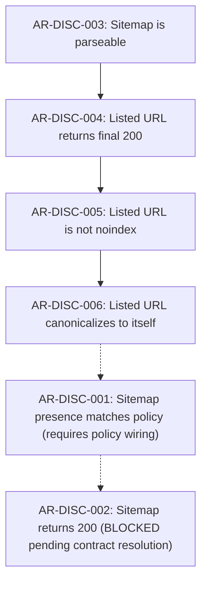

# Audit V1.8c: Sitemap Rule Readiness Assessment

## 1. Executive Summary & Context

- **Milestone:** Audit V1.8c — Sitemap Evidence Adapter Normalization
- **Repository:** `truthrive/technical-seo-audit`
- **Branch:** `main`
- **NormalizationVersion:** `v1.9.0` (bumped from `v1.8.0`)
- **Executable Rules:** Strictly `13/47` (unchanged; sitemap rule evaluators are **not** implemented in this phase)
- **Scope Boundary:** Adapter normalization layer only (`internal/audit/adapter/`). Zero diff to crawler (`internal/sitecrawl/**`), rule engine (`internal/audit/engine/**`), rule registry (`internal/audit/rules_v1.json`), or knowledge base (`knowledge/**`).

This document provides the formal six-rule evidence readiness assessment for `AR-DISC-001` through `AR-DISC-006` following the completion of V1.8c normalized evidence modeling.

---

## 2. Implemented Normalized Evidence

The V1.8c Adapter reads raw sitemap acquisition evidence from SQLite (`sitecrawl_sitemaps`, `sitecrawl_sitemap_entries`, `sitecrawl_sitemap_sources`, `sitecrawl_sitemap_discovery`) and normalizes it into the frozen `EvidenceSnapshot` without creating SEO verdicts.

### 2.1 Emitted Subject Types and Identifiers

| Subject Type | Subject Identifier Pattern | Description |
|---|---|---|
| `SubjectSitemap` (`SITEMAP`) | `sm:<audit_run_id>:<sitemap_id>` | Individual fetched sitemap document (e.g. `sm:audit:123:1`) |
| `SubjectSitemapEntry` (`SITEMAP_ENTRY`) | `sme:<audit_run_id>:<sitemap_id>:<seq>` | Individual `<url>` entry within a sitemap document (e.g. `sme:audit:123:1:0`) |
| `SubjectURL` (`URL`) | `url:<audit_run_id>:<url_id>` | Crawled or unadmitted URL subject in dictionary |
| `SubjectSite` (`SITE`) | `site` | Sitewide discovery and acquisition completeness telemetry |

### 2.2 Normalized Observations Catalog

#### Document Observations (`SubjectSitemap`)

- `sitemap_id`: Canonical sitemap document reference (`sm:<audit_run_id>:<sitemap_id>`)
- `sitemap_url`: Requested sitemap URL string
- `discovery_source`: Primary discovery source (`robots_txt`, `common_path`, `sitemap_index`)
- `discovery_sources`: Sorted comma-separated multi-source provenance (e.g. `common_path,robots_txt`)
- `parent_sitemap_ref`: Validated parent document reference (`sm:<audit_run_id>:<parent_id>`) when `parent_id > 0`
- `initial_http_status`: Initial HTTP response status (e.g. `200`, `301`, `404`, `0`)
- `final_http_status`: Final terminal HTTP response status (e.g. `200`, `404`, `0`)
- `sitemap_fetch_status`: Authoritative fetch status from acquisition
- `sitemap_redirect_hops`: Observed redirect hop count
- `sitemap_final_url`: Final redirect target URL when redirected
- `sitemap_fetch_error`: Direct network/TLS/timeout error string when fetch failed
- `sitemap_fetch_complete`: Boolean indicator of response completion
- `sitemap_document_type`: Derived XML document root structure (`URLSET`, `SITEMAP_INDEX`, `UNKNOWN`)
- `sitemap_parse_status`: XML decoder outcome (`parsed`, `xml_error`, `unsupported_structure`, `empty_input`, `not_attempted`, `unavailable`)
- `sitemap_parse_error`: Parser error diagnostic message
- `sitemap_entry_count`: Count of entries parsed from document
- `url_subject_ref`: Optional URL dictionary reference if sitemap URL was admitted

#### Entry Observations (`SubjectSitemapEntry`)

- `sitemap_entry_id`: Canonical entry reference (`sme:<audit_run_id>:<sitemap_id>:<seq>`)
- `parent_sitemap_ref`: Verified parent sitemap document reference
- `loc_raw`: Exact original `<loc>` element value from XML
- `loc_normalized`: Truthfully normalized URL string when safely resolvable
- `entry_seq`: 0-indexed position within parent document
- `lastmod_raw`: Raw `<lastmod>` string where present
- `changefreq_raw`: Raw `<changefreq>` string where present
- `priority_raw`: Raw `<priority>` string where present
- `url_subject_ref`: Correlated `url:<audit_run_id>:<url_id>` reference when validated

#### Bilateral URL Observations (`SubjectURL`)

Where a sitemap entry successfully correlates to an admitted URL subject:
- `listed_in_sitemap`: `"true"` (emitted once per correlated URL)
- `sitemap_entry_ref`: Reference to parent `SubjectSitemapEntry`
- `sitemap_document_ref`: Reference to parent `SubjectSitemap`
- `sitemap_url`: Discovered sitemap document URL

#### Sitewide Observations (`SubjectSite`)

- `sitemap_discovery_status`: Run status (`COMPLETED`, `NOT_ATTEMPTED`, `ATTEMPTED_INCOMPLETE`, `FAILED`, `UNKNOWN`)
- `sitemap_discovery_complete`: Strict completeness indicator (`true` or `false`)
- `sitemaps_found_count`: Total sitemap documents discovered
- `sitemap_entries_found_count`: Total sitemap entries parsed
- `sitemap_depth_capped`: Boolean indicating index recursion depth cap was reached
- `sitemap_urls_capped`: Boolean indicating max-URLs ceiling was reached
- `sitemap_byte_capped`: Boolean indicating document size byte cap was reached
- `sitemap_discovery_stop_reason`: Stop reason string when non-empty
- `sitemap_discovery_diagnostics`: Diagnostic message when non-empty

---

## 3. Correlation Integrity & Provenance Validation

The Adapter strictly enforces the frozen data model boundaries:

1. **Document-Entry Integrity:**
   - An entry may reference a document only if the parent sitemap exists in the current crawl run.
   - Orphan entries referencing non-existent parent documents emit `GAP_ORPHAN_SITEMAP_ENTRY` and suppress `parent_sitemap_ref`.

2. **Entry-URL Subject Integrity:**
   - An entry links to a `SubjectURL` only if:
     1. `url_id > 0`.
     2. `url_id` exists in `sitecrawl_urls` for the current crawl run.
     3. The listed `<loc>` and dictionary URL are consistent under URL normalization.
   - If `url_id == 0`, no `url_subject_ref` is synthesized.
   - If `url_id > 0` but points to a nonexistent dictionary ID or a conflicting URL, `GAP_INVALID_SITEMAP_URL_CORRELATION` is emitted, and dangling references are suppressed.
   - Sitemaps never synthesize new `SubjectURL` entities.

3. **Multi-Source Provenance:**
   - Sitemaps discovered through multiple channels (e.g. declared in `robots.txt` AND probed at `/sitemap.xml`) retain distinct sources in `discovery_sources`.
   - Index-child relationships preserve `parent_sitemap_ref` without collapsing root discovery sources.

4. **HTTP Redirect Provenance:**
   - `initial_http_status` and `final_http_status` are preserved independently.
   - `REQUESTED URL != FINAL URL` and `INITIAL STATUS != FINAL STATUS` invariants are maintained.
   - No verdict between initial vs terminal status is forced by the Adapter.

---

## 4. Completeness Telemetry & EvidenceGap Coverage

### 4.1 Discovery Completeness Invariant

`EvidenceSnapshot.SitemapDiscoveryComplete` is set to `true` **if and only if**:
- `sitecrawl_sitemap_discovery` record exists.
- `status == "COMPLETED"`.
- `!depth_capped && !urls_capped && !byte_capped`.

If the crawl run was canceled, discovery was disabled, limits were hit, or legacy tables were missing, `SitemapDiscoveryComplete` is strictly `false`.

### 4.2 EvidenceGap Behaviors

| Scenario | Gap Code Emitted | Scope | Rationale |
|---|---|---|---|
| Legacy crawl run | `GAP_SITEMAP_DOCUMENT_UNAVAILABLE` | Global | No sitemap tables exist in SQLite |
| Discovery disabled (`NOT_ATTEMPTED`) | `GAP_SITEMAP_DISCOVERY_DISABLED` | Global | Bypassed by configuration; absence unprovable |
| Completed with 0 sitemaps found | `GAP_SITEMAP_DOCUMENT_UNAVAILABLE` | Global | Probed sources exhausted with 0 documents |
| Incomplete discovery (`ATTEMPTED_INCOMPLETE`) | `GAP_SITEMAP_DISCOVERY_INCOMPLETE` | Global | Stopped early due to context cancel or timeout |
| Safety limit reached | `GAP_SITEMAP_TRUNCATED` | Global | Depth, URL, or byte cap truncated sitemap tree |
| Document fetch failure | `GAP_SITEMAP_FETCH_FAILED` | Per Document | Connection refused, timeout, or network failure |
| Document XML parse failure | `GAP_SITEMAP_PARSE_FAILED` | Per Document | Malformed XML, unclosed tag, or empty body |
| Orphan entry | `GAP_ORPHAN_SITEMAP_ENTRY` | Per Entry | References non-existent parent sitemap document |
| Contradictory entry correlation | `GAP_INVALID_SITEMAP_URL_CORRELATION` | Per Entry | `url_id` mismatch or missing from dictionary |
| Contradictory acquisition metadata | `GAP_SITEMAP_METADATA_INCONSISTENT` | Document/Site | Missing discovery record or non-existent parent |

---

## 5. Rule-by-Rule Readiness Matrix

| Rule ID | Catalog Check | Evaluator Title | Readiness Status | Supporting Normalized Evidence | Remaining Blocker / Dependency |
|---|---|---|---|---|---|
| **`AR-DISC-001`** | `DISC-001` | Sitemap presence matches project policy | **`NEEDS_POLICY`** | `sitemaps_found_count`, `sitemap_discovery_complete`, `discovery_sources` | Requires integrating `PolicyKeySitemapExpected` (`sitemap_expected`) into the Rule Engine evaluation context. |
| **`AR-DISC-002`** | `DISC-002` | Sitemap document returns 200 | **`BLOCKED`** | `initial_http_status`, `final_http_status`, `sitemap_fetch_status`, `sitemap_redirect_hops` | **Open contract decision:** Whether initial 3xx redirect to 200 document evaluates as `PASS` (terminal authoritative) or `FAIL` (initial authoritative). Blocked until authoritative contract resolution. |
| **`AR-DISC-003`** | `DISC-002` | Sitemap is parseable | **`READY_TO_IMPLEMENT`** | `sitemap_document_type`, `sitemap_parse_status`, `sitemap_parse_error`, `sitemap_fetch_complete` | None. All inputs fully normalized on `SubjectSitemap`. Evaluates independently from crawling or policy. |
| **`AR-DISC-004`** | `DISC-002` | Sitemap-listed URL returns final 200 | **`READY_TO_IMPLEMENT`** | `SubjectSitemapEntry` correlated to `SubjectURL.http_status`, `url_subject_ref` | None. Precondition and direct HTTP status observations fully verified. Uncrawled entries produce `UNKNOWN` cleanly. |
| **`AR-DISC-005`** | `DISC-002` | Sitemap-listed URL is not noindex | **`READY_TO_IMPLEMENT`** | `SubjectSitemapEntry` correlated to `SubjectURL.effective_noindex`, `http_status` | None. Evaluates on 200 HTML correlated URLs using existing normalized robots directives. |
| **`AR-DISC-006`** | `DISC-002` | Sitemap-listed URL canonicalizes to itself | **`READY_TO_IMPLEMENT`** | `SubjectSitemapEntry` correlated to `SubjectURL.canonical_count`, `canonical_normalized` | None. Evaluates canonical self-reference when exactly one valid canonical declaration exists. |

---

## 6. Analysis of Blocked & Policy-Dependent Rules

### 6.1 `AR-DISC-001`: Policy Dependency (`NEEDS_POLICY`)

- **Rule Contract:**
  - `PASS`: One or more sitemaps discovered.
  - `WARNING`: Zero sitemaps discovered AND `sitemap_expected = true`.
  - `MANUAL_REVIEW`: Zero sitemaps discovered AND policy unspecified.
  - `NOT_APPLICABLE`: `sitemap_expected = false`.
  - `UNKNOWN`: Discovery could not complete (`SitemapDiscoveryComplete = false`).
- **Readiness Analysis:**
  All acquisition evidence (`sitemaps_found_count`, `sitemap_discovery_complete`, `sitemap_discovery_status`) is fully normalized on `SubjectSite`.
  However, the Rule Engine `PolicyIndex` does not yet expose `PolicyKeySitemapExpected` resolution to evaluators. To avoid emitting false `WARNING` verdicts for sites that do not use sitemaps, `AR-DISC-001` must only be implemented when policy lookup is wired into the engine evaluator.

### 6.2 `AR-DISC-002`: Redirect Semantics Ambiguity (`BLOCKED`)

- **Rule Contract Ambiguity:**
  The manifest requires `sitemap_url` and `sitemap_fetch_status`, producing:
  - `PASS`: response is 200.
  - `FAIL`: HTTP response is non-200.
  - `UNKNOWN`: request fails before HTTP response.
- **The Core Ambiguity:**
  If a discovered sitemap URL `https://example.com/sitemap.xml` responds `301 Moved Permanently` to `https://example.com/sitemap_index.xml` (which responds `200 OK`):
  - *Option A (Initial Authoritative):* Produces `FAIL` for `https://example.com/sitemap.xml` because its immediate status was non-200.
  - *Option B (Terminal Authoritative):* Produces `PASS` because following redirects led to a terminal 200 sitemap document.
- **Why it Remains BLOCKED:**
  Neither the frozen atomic rule manifest nor authoritative RFC/spec documentation dictates whether a redirected sitemap is a PASS or FAIL. Picking one arbitrarily would violate product principles. The Adapter preserves both `initial_http_status` and `final_http_status` truthfully, allowing `AR-DISC-002` to remain blocked until an authoritative contract decision is approved.

---

## 7. Recommended Implementation Sequence for Audit V1.8d

Based on evidence readiness and contract stability, the recommended implementation order for V1.8d sitemap evaluators is:

1. **Step 1: Implement `AR-DISC-003` (Sitemap is parseable)**
   - *Subject:* `SubjectSitemap`
   - *Rationale:* Completely self-contained document evaluation. Validates XML parsing without dependency on URL crawling or external policy.
2. **Step 2: Implement `AR-DISC-004` (Sitemap-listed URL returns final 200)**
   - *Subject:* `SubjectSitemapEntry`
   - *Rationale:* Fundamental URL-level status check. Directly tests correlation and handles uncrawled entries as `UNKNOWN`.
3. **Step 3: Implement `AR-DISC-005` (Sitemap-listed URL is not noindex)**
   - *Subject:* `SubjectSitemapEntry`
   - *Rationale:* Preconditioned on 200 HTML from `AR-DISC-004`. Verifies indexability consistency using existing normalized directives.
4. **Step 4: Implement `AR-DISC-006` (Sitemap-listed URL canonicalizes to itself)**
   - *Subject:* `SubjectSitemapEntry`
   - *Rationale:* Preconditioned on 200 HTML. Verifies canonical declaration consistency without inventing canonical requirements.
5. **Step 5: Implement `AR-DISC-001`** (only once `PolicyKeySitemapExpected` engine lookup is wired).
6. **Deferred: `AR-DISC-002`** (remains blocked until redirect policy is formally defined).
